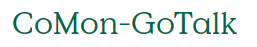
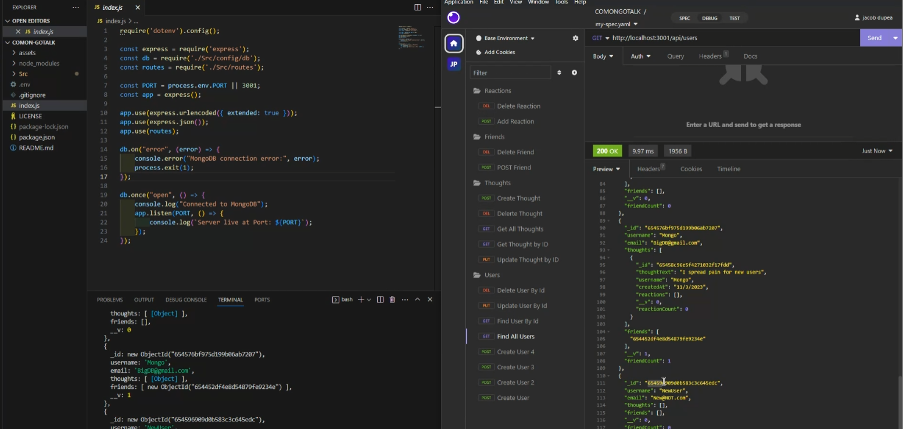

<h1 align="center">CoMon-GoTalk</h1>

 

<h2 align="center">Description</h2>
This project is a NoSQL api backend for a social media startup. It uses mongodb to connect to a database to make and sync models for Users, Thoughts, Reactions and Friends.
## Table of Contents

- [Installation](##installation)
- [Usage](##usage)
- [License](##license)

<h2 align="center"> Installation</h2>

steps required
Clone repo then run in a terminal, first install packages then run node index.js

<h2 align="center">Photos</h2>

CLICK IMAGE BELOW FOR DEMO!

<h2 align="center">Usage</h2>

Can be used and refractored to connect to a front end of a social media company as a backend api.

<h2 align="center">License</h2>

refer to repo for licenses
license is a MIT license.

<h2 align="center">Badges</h2>

<h2 align="center">Features</h2>

routes to create users and thoughts belonging to a user, update and delete users and thoughts. routes to view individual users and thoughts. routes to add reactions to thoughts, update and delete reactions to thoughts. routes to add and remove friends from a users frineds list.

<h2 align="center"> How to Contribute</h2>

You can contribute by cloning the repo and making any changes and making a request to change, or reach out to me at my email with request.

<h2 align="center">Tests</h2>

npm i

<h2 align="center">Questions</h2>

reach my git hub profile at (https://github.com/DupeaJ)

  

If you have additional questions you can reach me at jacobdupea@gmail.com
